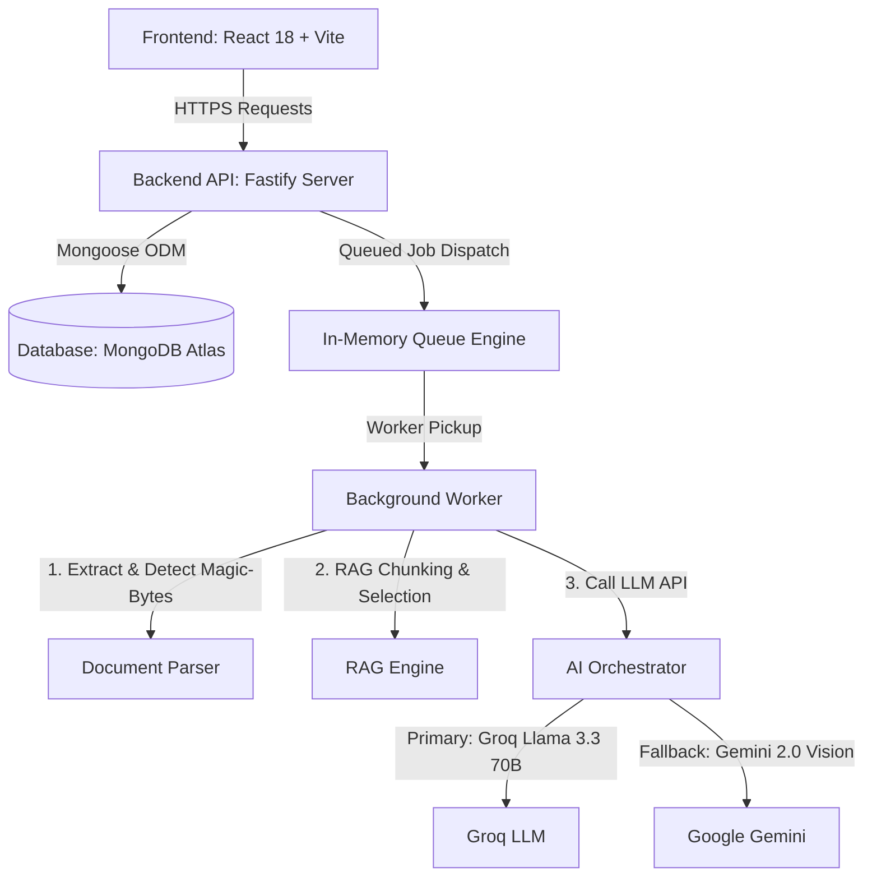

# VedaAI — Architecture Overview

VedaAI is a production-grade AI Assessment Creator designed to let teachers effortlessly generate balanced, curriculum-aligned tests from textbooks, notes, and photos, and view structured exam-style papers.

---

## 🏗️ End-to-End Architectural Layering

### 1. Client Layer (React 18 + Vite SPA)
- High-fidelity single-page application focused on high responsiveness and minimal overhead.
- Includes step-by-step test configuration wizard with active file dropzones and native calendar selectors.
- Renders responsive, printable exam-style paper worksheets with layout components.

### 2. API Server Layer (Node.js + Fastify)
- High-throughput API server with strict global rate limiting (60 requests/minute per client).
- Employs multipart parser supporting up to 20MB file uploads for complex documents and photos.
- Decoupled from heavy AI processing jobs via a robust background queue service to prevent request timeouts.

### 3. Queue & Background Job System
- Background generation tasks run in a highly resilient local job engine mimicking the BullMQ queue API.
- Prevents HTTP connection drops during heavy Groq/Gemini calls by allowing client polling.

---

## ⚡ Key Architectural Pipelines

### A. Document Parsing & Image Detection (Direct Snapshot OCR)
To support snap-and-generate mobile features for textbook pages:
1. **Magic-Byte Sniffer**: The document parser inspects the binary buffer headers immediately on upload.
2. **PDF Parsing**: Digital PDF buffers are extracted using server-side `pdf-parse`, sanitized, and cleaned.
3. **Multimodal OCR Bypass**: If buffer magic-bytes identify a PNG/JPEG image or a scanned PDF (under 50 text characters), text extraction is bypassed. The raw file buffer is base64 encoded and dispatched to Google Gemini 2.0 Flash's multimodal vision endpoint, extracting questions directly from images of worksheets.

### B. RAG (Retrieval-Augmented Generation) Core
For text documents exceeding large prompt limits, VedaAI leverages a mini RAG engine:
1. **Chunking**: Sanitized text is split into chunks of `2500` characters with a `500` character overlap.
2. **Relevance Selection**: Active semantic algorithms select the top `4` most informative chunks (~10k characters) to construct a comprehensive context payload for the LLM.

### C. Multi-Model AI Orchestrator
To guarantee 100% service uptime:
1. **Primary Model**: Groq API Llama 3.3 70B Versatile running in strict JSON Object mode.
2. **High-Speed Fallback**: Groq Llama 3.1 8B Instant (in case of primary rate limiting).
3. **Disaster/OCR Provider**: Google Gemini 2.0 Flash API (for scanned images and vision OCR).
