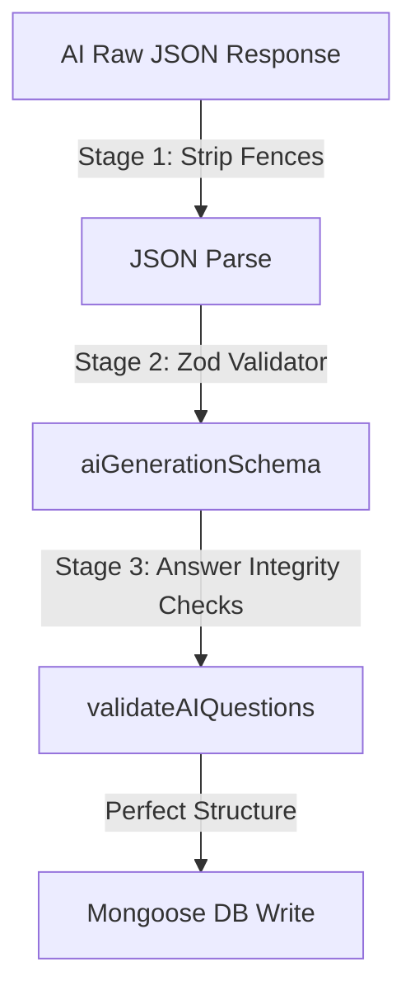

# VedaAI — Prompt Engineering & AI Structuring

To ensure highly accurate, balanced, and deterministic output from Large Language Models (LLMs) like Llama 3.3 and Gemini 2.0, VedaAI implements structured prompt engineering and post-inference Zod schema validations.

---

## 🛠️ 1. Text-Based Ingestion Prompts

When text is extracted from a digital PDF, the backend structures the system and user instructions as follows:

### System Prompt
Enforces role-playing parameters and exact response structures:
```text
You are a professional assessment engine. Output valid JSON strictly. No markdown fences.
```

### User Prompt
Passes the context, configurations, and strict schema parameters:
```text
Based on the following extracted text, generate an assessment with EXACTLY [numQuestions] questions.
Difficulty level: [DIFFICULTY].

TEXT SOURCE:
[Extracted Text Content Chunks (RAG)]

OUTPUT FORMAT:
{
  "mcqs": [{"question": "...", "options": ["A", "B", "C", "D"], "answer": "Exact option text"}],
  "shortAnswers": [{"question": "...", "answer": "..."}]
}

RULES:
- Each MCQ MUST have exactly 4 options.
- Questions must be unique.
- Return ONLY valid JSON. No conversational text.
```

---

## 📸 2. Multimodal Snapshot OCR Prompts (Gemini 2.0 Vision)

If the teacher uploads a snapshot image of a textbook page or a scanned document, the file is routed to Gemini 2.0 Flash as an `inlineData` block.

- **System and User Combined Instruction**:
```text
You are an expert AI assessment engine. Read this scanned document, perform visual OCR, extract the text and diagrams, and generate an assessment with EXACTLY [numQuestions] questions.
Difficulty level: [DIFFICULTY].

OUTPUT FORMAT:
{
  "mcqs": [{"question": "...", "options": ["A", "B", "C", "D"], "answer": "Exact option text"}],
  "shortAnswers": [{"question": "...", "answer": "..."}]
}

RULES:
- Each MCQ MUST have exactly 4 options.
- Return ONLY valid JSON matching the format. No conversational text or markdown code blocks.
```

- **Mime Configuration**:
  - For image uploads: `image/png` or `image/jpeg` passed directly.
  - For scanned PDFs: `application/pdf` passed natively.

---

## 🛡️ 3. Post-Inference Validation Pipeline

Once the LLM returns its response, the backend passes it through a multi-stage validation pipeline:



### A. Stage 1: Stripping Markdown Fences
AI outputs can sometimes include markdown code fences even when asked to omit them. The parsing utility cleans these immediately:
```javascript
const cleaned = raw
  .replace(/```json\s*/gi, '')
  .replace(/```\s*/g, '')
  .trim();
```

### B. Stage 2: Zod Structure Validation
Uses Zod to guarantee the array elements match the exact schema expected by the frontend:
```javascript
const aiGenerationSchema = z.object({
  mcqs: z.array(z.object({
    question: z.string(),
    options: z.array(z.string()).length(4),
    answer: z.string()
  })).optional(),
  shortAnswers: z.array(z.object({
    question: z.string(),
    answer: z.string()
  })).optional()
});
```

### C. Stage 3: Answer Integrity Checks (`validators.js`)
Performs dynamic cross-checks on each question:
1. **Deduplication**: Removes duplicate questions generated by the LLM.
2. **Answer In-Options Check**: For MCQs, verifies that the string in `answer` perfectly matches one of the four options in the `options` array. If it doesn't match exactly, the system auto-corrects or discards it to prevent broken questions from appearing on the student's test.
